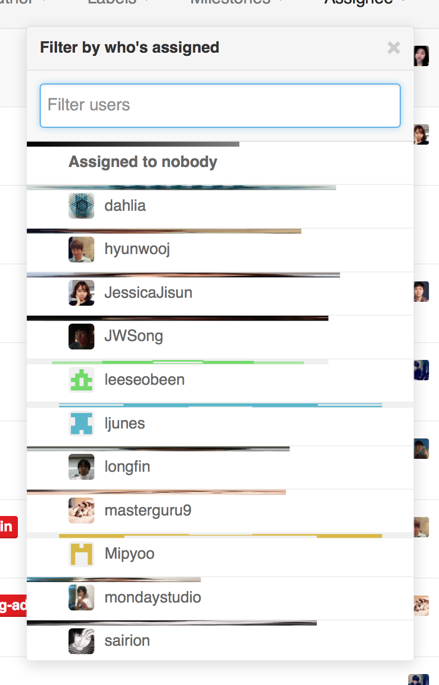

GitHub Issues Powerpack
=======================

This userscript provides the following more features than vanilla GitHub issues. You need [Greasemonkey][] on Firefox, or [Tempermonkey] on Chrome.

[Install the script](gh-issues-powerpack.user.js)

Distributed under [GPLv3][] or later.

[Greasemonkey]: https://addons.mozilla.org/en-US/firefox/addon/greasemonkey/
[Tempermonkey]: https://chrome.google.com/webstore/detail/tampermonkey/dhdgffkkebhmkfjojejmpbldmpobfkfo?hl=en
[GPLv3]: http://www.gnu.org/licenses/gpl-3.0.html

Progress bar
------------

Show each member's progress in asignee filtering popup window.

